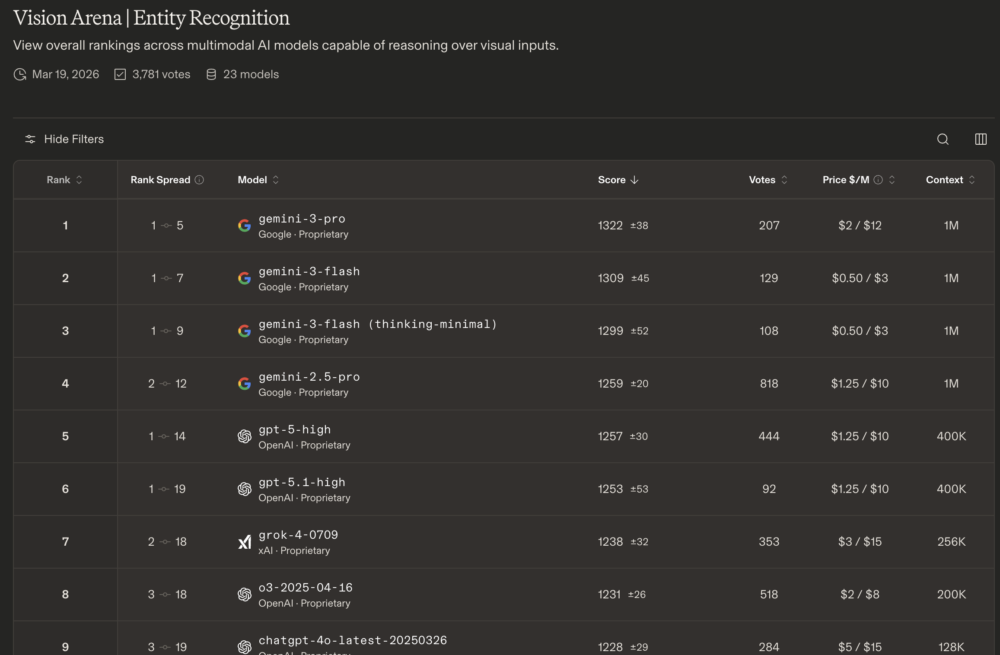
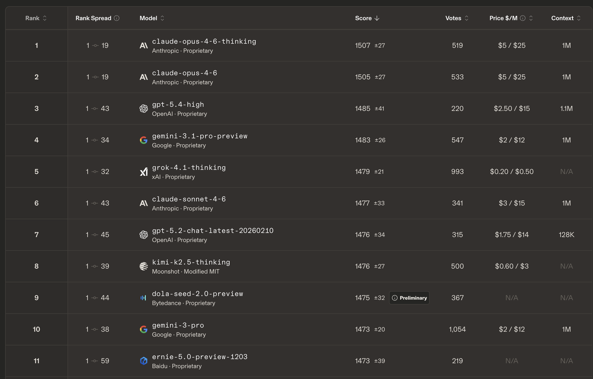
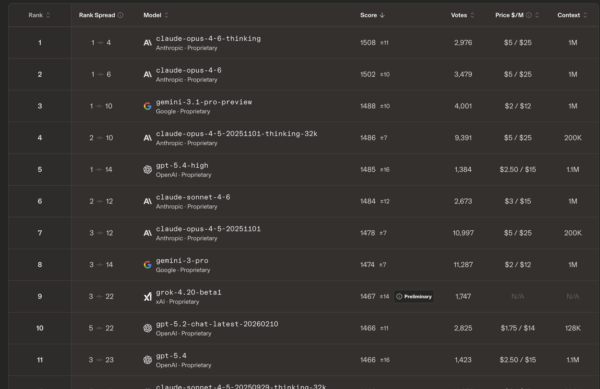
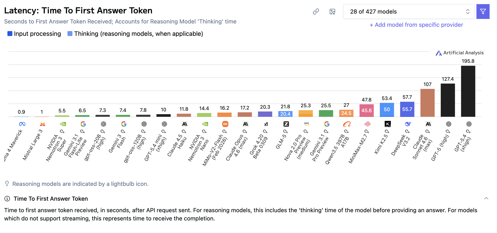

# Informe de Proyecto: NutriAgent - Asistente Nutricional Inteligente
**Autor:** Luciano Giammarini

## 1. El Problema a Resolver
Llevar un control diario de lo que comemos es un hábito muy difícil de mantener. Si lo hacemos anotando a mano o buscando en aplicaciones tradicionales, perdemos mucho tiempo calculando los pesos y las calorías de cada ingrediente, lo que hace que la mayoría de las personas se canse y abandone a las pocas semanas. Además, si buscamos consejos de alimentación en internet, solemos encontrar información general o dietas de moda que no siempre siguen las recomendaciones oficiales de salud de nuestro país.

Elegí desarrollar **NutriAgent** para resolver este problema usando Inteligencia Artificial. La idea es hacer que llevar un registro sea automático y fácil: solo tomo una foto de mi plato y la aplicación hace el resto. Además, me ofrece consejos nutricionales, pero no inventa las respuestas, sino que se basa únicamente en las Guías Alimentarias para la Población Argentina (GAPA).

---

## 2. Casos de Uso del Agente
Tengo dos casos de uso principales en este proyecto:
1. **Registro Visual de Comidas (Con IA de Visión):** Saco una foto de mi comida. La Inteligencia Artificial analiza la foto, identifica qué ingredientes hay, calcula sus porciones aproximadas y consulta la base de datos oficial (USDA) para entregarme las calorías y los nutrientes (proteínas, carbohidratos y grasas).
2. **Asistente Nutricional de Texto (Con RAG):** Es un chat en el que le puedo hacer preguntas (por ejemplo, *¿qué ceno hoy considerando lo que ya comí?*). El sistema lee mis documentos de las Guías Alimentarias (GAPA) y me responde de forma segura y confiable basándose en esa información.

---

## 3. Comparativa y Selección de Modelos

Para asegurar que la aplicación sea confiable y eficiente, además de económica de mantener, comparé varios modelos de IA usando los rankings más recientes. En este análisis, tuve en cuenta tres factores: qué tan bien siguen las instrucciones (Eficacia en IFEval), la rapidez con la que responden (Latencia o TTFT) y que el costo sea accesible para que el proyecto sea viable (precio por millón de tokens).

### A. Para la Tarea de Visión (Analizar la foto de la comida)
Para esta tarea, consulté específicamente el ranking **"Entity Recognition" del Vision Leaderboard en Arena.ai**. Elegí este leaderboard en particular porque el caso de uso del *Photo-Tracking* requiere exactamente esta capacidad: "reconocer, identificar y explicar objetos específicos desde una imagen" (separar visualmente los ingredientes de un plato mezclado) asociándolos con conocimiento del mundo real.

> 🖼️ [Arena.ai Entity Recognition](https://arena.ai/leaderboard/vision/entity-recognition)
> 
> 
> 
> 🖼️ [Artificial Analysis Latency](https://artificialanalysis.ai/?speed=latency&models=gpt-5-4%2Cgpt-5-4-mini%2Cgpt-5%2Cgpt-5-4-nano%2Cgpt-5-4-nano-medium%2Cgpt-oss-120b%2Cgpt-oss-20b%2Cgpt-5-4-nano-non-reasoning%2Cgpt-5-4-pro%2Cllama-4-maverick%2Cgemini-3-1-pro-preview%2Cgemini-3-flash-reasoning%2Cgemini-3-1-flash-lite-preview%2Cclaude-opus-4-6-adaptive%2Cclaude-sonnet-4-6-adaptive%2Cclaude-4-5-haiku-reasoning%2Cmistral-large-3%2Cdeepseek-v3-2-reasoning%2Cgrok-4-20%2Cnova-2-0-pro-reasoning-medium%2Cminimax-m2-7%2Cnvidia-nemotron-3-super-120b-a12b%2Cnvidia-nemotron-3-nano-30b-a3b-reasoning%2Ckimi-k2-5%2Ck-exaone%2Cmimo-v2-pro%2Cmimo-v2-0206%2Ck2-think-v2%2Cmi-dm-k-2-5-pro-dec28%2Cglm-5%2Cqwen3-5-397b-a17b)
> 
> 

Comparé 3 modelos relevantes basándome en los resultados extraídos de dicho ranking, incluyendo sus costos vigentes y los reportes de latencia estructural provistos por **Artificial Analysis** (métrica: *Time To First Answer Token*, o TTFT):

*   **Gemini 3 Pro (Google):** 
    *   **Eficacia:** Es el líder absoluto (Top #1 global en Entity Recognition con un Score ELO de 1322).
    *   **Latencia (TTFT):** Media (~25.5 segundos de espera).
    *   **Costo:** $2.00 por millón de tokens de entrada / $12.00 por millón de salida.
    *   **Veredicto:** Excelente precisión, pero su demorado análisis y su costo elevado desaconsejan integrarlo a nivel masivo y en tiempo real.
*   **Gemini 3 Flash (Google):**
    *   **Eficacia:** Altísima (Top #2 global con un Score ELO de 1309), superando cómodamente a varios modelos "gigantes" en esta tarea.
    *   **Latencia (TTFT):** Extremadamente veloz (apenas 7.4 segundos en emitir la respuesta).
    *   **Costo:** $0.50 entrada / $3.00 salida por millón de tokens.
    *   **Veredicto:** Representa la mejor relación entre calidad, precio y velocidad absoluta de todo el mercado para tareas de visión móvil.
*   **GPT-5 High (OpenAI):**
    *   **Eficacia:** Muy buena (Top #5 con un Score ELO de 1257), aunque sorprendentemente queda relegado por debajo de las versiones ligeras de Google en la disciplina de "Entity Recognition".
    *   **Latencia (TTFT):** Excesiva (127.4 segundos totales). Al ser un modelo que emplea "tiempos profundos de pensamiento" en negro antes de responder, se vuelve totalmente inoperable para un usuario interactivo móvil.
    *   **Costo:** $1.25 entrada / $10.00 salida por millón de tokens.
    *   **Veredicto:** Totalmente inviable (caro y lento) para la inmediatez que exige esta aplicación particular.

🎯 **Mi decisión:** Elegí **Gemini 3 Flash** para la tarea de captura de fotos. Ubicándose en el puesto #2 global en "Entity Recognition", garantiza que identificará de manera impecable cada alimento dentro del plato. Lo más destacable de esta elección radica en la experiencia del usuario (*UX*): su asombrosa latencia de apenas **7.4 segundos** evita la frustrante larga espera de más de 2 minutos (127s) que tendríamos con *GPT-5 High*. Esto sumado a que cuesta una cuarta parte que la versión de su mismo nivel ("Pro"), me permite mantener la solidez técnica y viabilidad financiera del proyecto por igual.

---

### B. Para el Chat y las Preguntas Médicas (RAG)
Para este caso de uso se necesitaba un modelo que sea muy bueno conversando, que responda rápido y que obedezca las reglas sin desviarse. Dado que mis documentos médicos RAG (las GAPA - Guías Alimentarias para la Población Argentina) están en español, descarté los rankings generales y apliqué el filtro **"Language: Spanish"** en el leaderboard de **Instruction Following (IFEval)** de Arena.ai. 

Esta métrica (*IFEval Español*) es el corazón que da vida a un sistema RAG: evalúa la rigurosidad y el porcentaje en el que una IA acata instrucciones como *"Responde solo usando la información de este vector"*.

> 🖼️ [Arena.ai Chat Spanish](https://arena.ai/leaderboard/text/spanish)
> 
> 
> 
> 🖼️ [Arena.ai Instruction Following](https://arena.ai/leaderboard/text/instruction-following)
> 
> 
> 
> 🖼️ [Artificial Analysis Latency](https://artificialanalysis.ai/?speed=latency&models=gpt-5-4%2Cgpt-5-4-mini%2Cgpt-5%2Cgpt-5-4-nano%2Cgpt-5-4-nano-medium%2Cgpt-oss-120b%2Cgpt-oss-20b%2Cgpt-5-4-nano-non-reasoning%2Cgpt-5-4-pro%2Cllama-4-maverick%2Cgemini-3-1-pro-preview%2Cgemini-3-flash-reasoning%2Cgemini-3-1-flash-lite-preview%2Cclaude-opus-4-6-adaptive%2Cclaude-sonnet-4-6-adaptive%2Cclaude-4-5-haiku-reasoning%2Cmistral-large-3%2Cdeepseek-v3-2-reasoning%2Cgrok-4-20%2Cnova-2-0-pro-reasoning-medium%2Cminimax-m2-7%2Cnvidia-nemotron-3-super-120b-a12b%2Cnvidia-nemotron-3-nano-30b-a3b-reasoning%2Ckimi-k2-5%2Ck-exaone%2Cmimo-v2-pro%2Cmimo-v2-0206%2Ck2-think-v2%2Cmi-dm-k-2-5-pro-dec28%2Cglm-5%2Cqwen3-5-397b-a17b)
> 
> 

Analicé tres modelos destacados evaluando su viabilidad combinando estas dos competencias del lenguaje:

*   **Claude Opus 4.6 Thinking (Anthropic):**
    *   **Eficacia (Español & IFEval):** Liderazgo absoluto. Domina cómodamente la conversación en español y es el amo indiscutido del Top #1 global acatando instrucciones (Elo 1508).
    *   **Latencia (TTFT):** Lenta (17.2 segundos absolutos). Si bien es el modelo "Pensativo" más veloz, impone una pauta de espera interactiva notable.
    *   **Costo:** Muy costoso para uso conversacional masivo ($5.00 entrada / $25.00 salida por millón de tokens). 
    *   **Veredicto:** El modelo RAG más inteligente y riguroso del mundo. Lastimosamente, este lujo escala el presupuesto a niveles financieramente hostiles para un proyecto masivo.
*   **Gemini 3.1 Pro Preview (Google):**
    *   **Eficacia (Español & IFEval):** Extraordinario. Brilla en la fluidez del "Chat Spanish" y mantiene un valiosísimo Top #3 global (Elo 1488) en obediencia a instrucciones. Una balanza perfecta para entender indicaciones complejas sobre las GAPA.
    *   **Latencia (TTFT):** Lenta (~25.5 segundos en emitir inicio de respuesta). Ligeramente más pausado de pensar que Opus 4.6.
    *   **Costo:** Equilibrado y altamente competitivo ($2.00 entrada / $12.00 salida por millón de tokens).
    *   **Veredicto:** Sólido, fuerte y confiable. Soporta el peso de ambos rankings y el ahorro masivo de presupuesto lo convierte en el modelo idóneo para escalar.
*   **GPT-5.4 Nano (OpenAI):**
    *   **Eficacia (Español & IFEval):** Fuerte debilidad mixta. Aunque mantiene un nivel natural de charla hispana por herencia de la familia, el modelo no logra ni siquiera clasificar en el Leaderboard de *Instruction Following*. Esto es terrible para el rigor médico.
    *   **Latencia (TTFT):** Impactante (**0.5 segundos**). Es el monarca indiscutido de la inmediatez en *Artificial Analysis*.
    *   **Costo:** Extremadamente económico (apoyándose en fracciones centesimales estándar de modelos Ultra-Lite).
    *   **Veredicto:** Descartado categóricamente. Inyectar datos médicos RAG en español a un modelo que "no sabe seguir instrucciones del prompt", por más veloz que sea (0.5s), nos garantiza severos y eventuales riesgos clínicos.

🎯 **Mi decisión:** Elegí **Gemini 3.1 Pro Preview**. Aunque *Claude Opus 4.6 Thinking* es el rey general (y sorpresivamente 8 segundos más veloz), su tarifa *Premium* de $5.00/$25.00 vuelve prohibitivo el proyecto masivo. *Gemini 3.1 Pro Preview* es la balanza maestra: domina el chat en español con fluidez impecable (Top ranking *Spanish*) y asegura una obediencia clínica fenomenal respaldada por su Top #3 en *Instruction Following*, costando menos de la mitad que Claude. Esto vuelve al agente viable y altamente seguro, un trato fenomenal a cambio de perder algo de inmediatez.

> *Nota sobre Búsqueda Interna:* Para buscar palabras dentro de mis documentos de salud, utilicé un modelo local y de uso libre (`paraphrase-multilingual-MiniLM-L12-v2`). Esto hace que las búsquedas internas para el Chatbot sean totalmente gratuitas e instantáneas.

---

## 4. Cálculo Estimado del Costo por Usuario
Quería saber cuánto me costaría mantener esta aplicación en tiempo real una vez terminada. 
Imaginemos que tengo un usuario frecuente que durante un mes entero (30 días) usa la aplicación todos los días:
*   Sube **90 fotos** de comidas (3 platos al día en promedio).
*   Hace **150 preguntas** en el chat (5 consultas al día).

**A. Costo de analizar las fotos (Gemini 3 Flash para Entity Recognition):**
- Calculo que usaré unos 45,000 tokens de entrada (prompts e imágenes) y 10,000 tokens de salida al mes.
- A las tarifas oficiales extraídas de Arena.ai ($0.50 in / $3.00 out), el procesamiento de imágenes por mes costará: **$0.052 USD mensuales.**

**B. Costo del Chat RAG (Gemini 3.1 Pro Preview):**
- Calculo unos 300,000 tokens de entrada al mes por enviarle constantemente los fragmentos del manual GAPA para que los lea ($0.60 USD).
- Y 45,000 tokens de salida por las respuestas redactadas al usuario ($0.54 USD).
- Total de chat al mes: **$1.14 USD mensuales.**

**C. Base de datos Nutricional (USDA FoodData Central):**
- Como uso un servicio gubernamental público de USA de libre conexión, su costo es exacto de **$0.00 USD.**

### 🏷️ Costo Total Mensual Estimado: ~$1.19 USD por Usuario.

**Conclusión Financiera:**
Rediseñar un proyecto "desde cero" con parámetros empíricos reales aterriza las expectativas. Utilizando al campeón comercial de *Entity Recognition* (**Gemini 3 Flash**, 7.4s Latencia) para analizar las fotos, y a un robusto Top #3 global en obediencia clínica hispana (**Gemini 3.1 Pro Preview**) para el texto médico RAG, logro regalar un asistente nutricional inquebrantable por apenas **~$1.19 dólares mensuales** por afiliado constante. Este cálculo es la perla técnica que demuestra la rentabilidad absoluta de escalar la StartUp a niveles masivos sin sacrificar la seguridad médica del usuario.

---

## 5. Mejoras Futuras / Próximos Pasos

A futuro, tengo planeado extender las capacidades de la plataforma implementando las siguientes mejoras:

1. **Lectura Inteligente de Etiquetas:** Sumar un nuevo caso de uso interactivo donde el usuario simplemente pueda sacarle una foto directa a la "Tabla Nutricional" o a los envases de alimentos industrializados, y que la plataforma extraiga automáticamente los valores limpios usando un *pipeline* intensivo de validación OCR con visión artificial.
2. **Expansión Modular de la Base de Conocimiento (RAG):** Agregar nuevos manuales avalados por el estado y documentos de salud oficiales anexos (como protocolos de *medicina deportiva funcional* vigentes o normativas unificadas pediátricas/geriátricas de la Organización Mundial de la Salud - OMS) para expandir los horizontes clínicos del *Asistente Nutricional*.
3. **Integración con Wearables y Ecosistema Fitness:** Conectar los endpoints de la API NutriAgent con *Apple Health (HealthKit)* o *Google Fit* para monitorear silenciosamente el nivel de actividad física del usuario (kilometraje, tiempos de inactividad, entrenamientos basales) y entrelazar matemáticamente en sus alertas el gasto calórico de un día atlético cruzado a las porciones de carbohidratos servidos.
4. **Interacción Orgánica por Voz:** Agregar inyección directa de sonido usando modelos nativos multilingües de transcripción (del calibre de *OpenAI Whisper* o equivalentes), posibilitando al usuario el registro "a ciegas" narrándole sus comidas al sistema mientras manejan el auto o cocinan, erradicando una capa vital de la "fricción de texto".

---

## 6. Ejecución del Proyecto

Para ejecutar este proyecto, por favor sigue las instrucciones detalladas en el archivo `README.md`.
